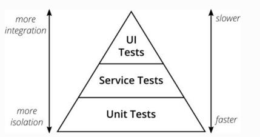
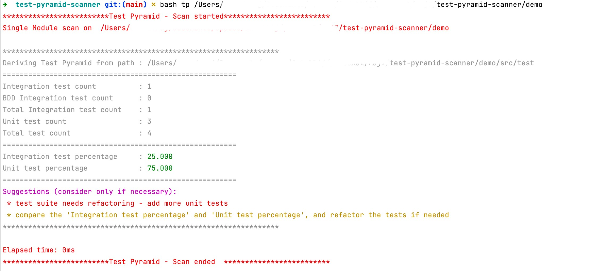
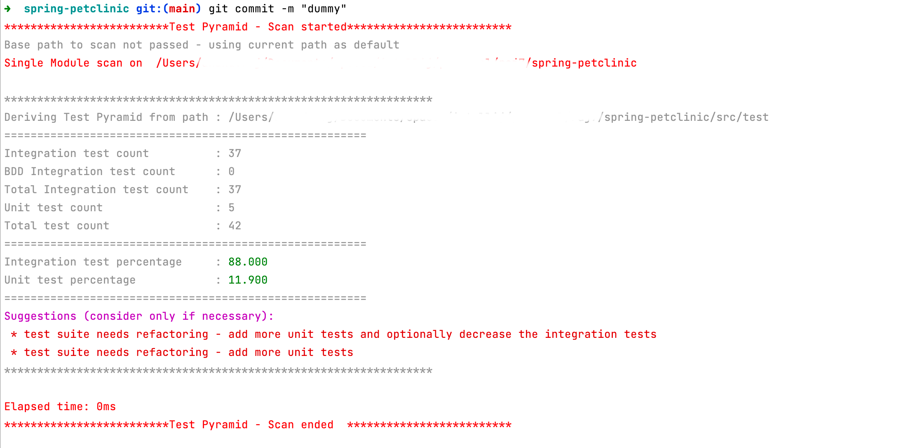

# test-pyramid-scanner
### What :
Test pyramid is one of good practices that should be followed while working on tests.

https://martinfowler.com/articles/practical-test-pyramid.html

The attached script could be used to give us a sense of TestPyramid of our applications (mainly the Unit tests + Integration/service tests).

### Why :
Developers working on the applications can easily miss the count on number tests that is written over the time. \
As the Integration test increases(relatively less unit test), tests get slower and leading to unnecessary refactoring. \
The main issue is the lack of early feedback about the number of tests written, this script could fill in that void and make the developers more proactive (when integrated as PRE-COMMIT hook).

### How :
Ways to execute ->
1. bash tp /{application_absolute_path}
   - bash tp /Users/12345/Documents/MyApps/test-pyramid-scanner/demo
   

   

   
2. Integrate as git GLOBAL PRE-COMMIT hook (better and suggested). 
   - Add the below lines in /Users/12345/.gitconfig file : \
     [core] \
     hooksPath = /Users/12345/.git-template/hooks
   - Create this folder if not exists already,
     - /Users/12345/.git-template/hooks
   - If 'pre-commit' file already exists, copy and paste the script to the end, else,
     - Copy and paste the 'tp' script file into /Users/12345/.git-template/hooks and rename to 'pre-commit'
     - Make it executable -> chmod +x 'pre-commit'
   - Test it with any of your existing git repo/https://github.com/spring-projects/spring-petclinic)

#### Note : Supports only for Java, springboot, cucumber(bdd) based applications